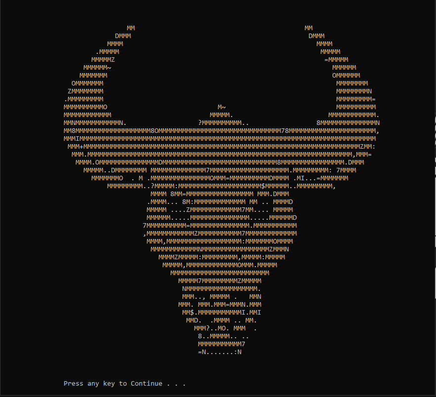
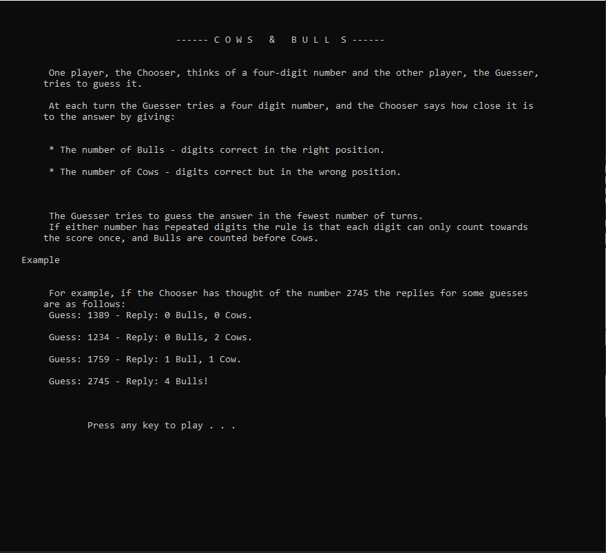
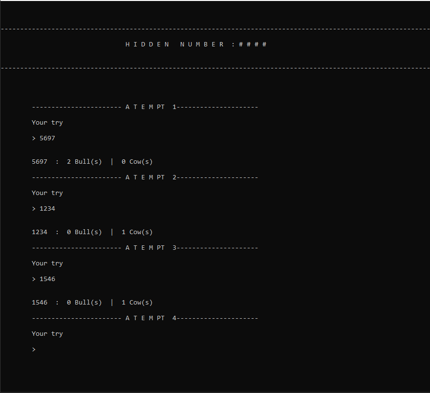
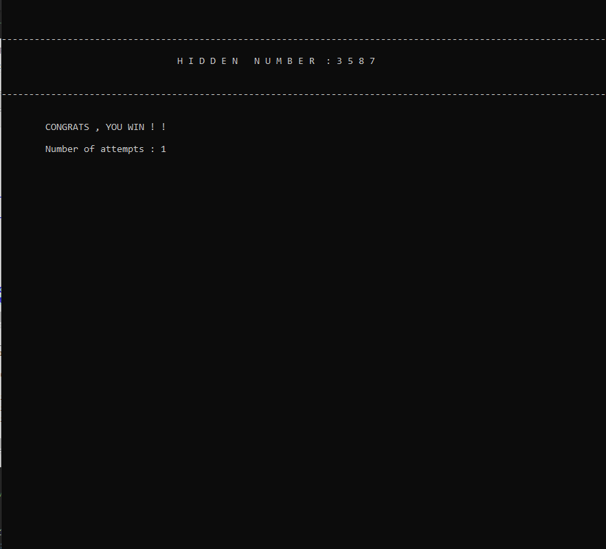

# elToro-Beta

Cows and bulls game coded in C . 

#Coded by AymKh 2019

The code is messy and has alot of bugs, for instance the user input is not being monitered .

when the game starts a logo screen will display along with some rules .

The player then starts guessing the number and getting the right answer, eventually .

